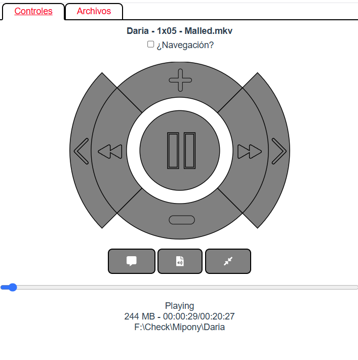
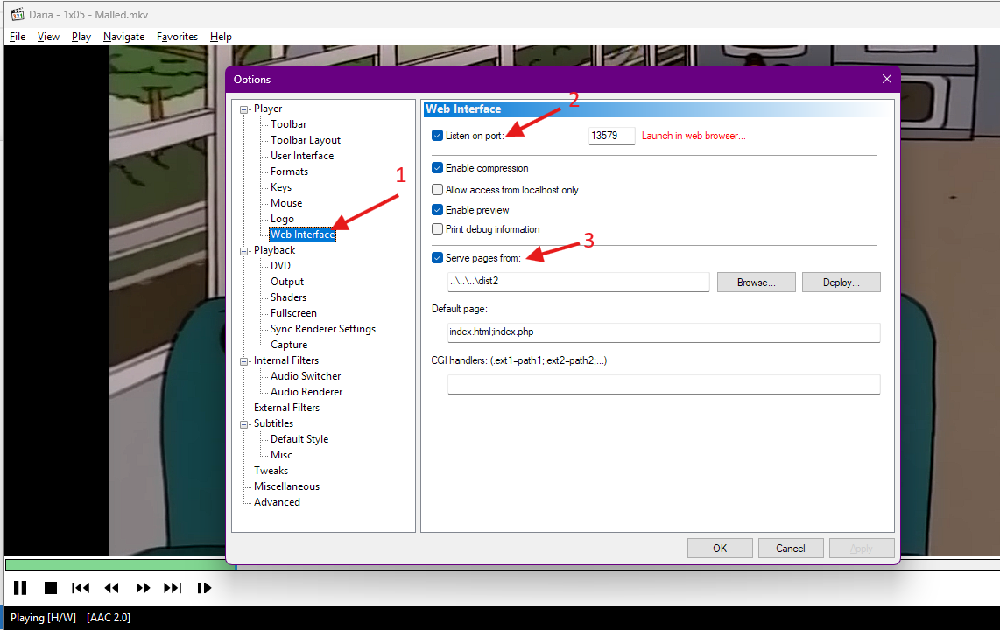

# mpc_webui

This project is a simple remote controller for mpc-hc powered by vue2.js. An old version cause I did it a long time ago.

## Project setup
```
npm install
```

### Compiles and hot-reloads for development
```
npm run serve
```

### Compiles and minifies for production
```
npm run build
```

### Lints and fixes files
```
npm run lint
```

### Customize configuration
See [Configuration Reference](https://cli.vuejs.org/config/).


### Preview


### Enable for mpc-hc

- Go to options
- Click on web interface
- Enable "Listen on port" default is 13579, will be access through http:localhost:13579/index.html.
- Enable "Serve pages from" and pick the path of the page built (dist generated)
  
